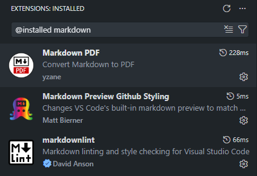

# almafa

## Collecting configurations accross all modules

### Module A

> [!NOTE]
> You can find Debian home [here](linux/README.md).

### Module B

> [!NOTE]
> You can find Windows home [here](windows/README.md).

### Module C

> [!NOTE]
> You can find Cisco home [here](cisco/README.md).

### Automation

> [!NOTE]
> You can find automation home [here](automation/README.md).

### Module D

> [!NOTE]
> You can everything else [here](else/README.md).

## Images

You can find images in the sweedish SFTP server:
rsync.ntnet.se

## VScode Extensions

> [!TIP]
> I installed the following VSCode extensions for editing markdown files with GitHub styled markdown preview. You can find more about GitHub styling under [THIS](https://docs.github.com/en/get-started/writing-on-github/getting-started-with-writing-and-formatting-on-github/basic-writing-and-formatting-syntax#hiding-content-with-comments) URL.

