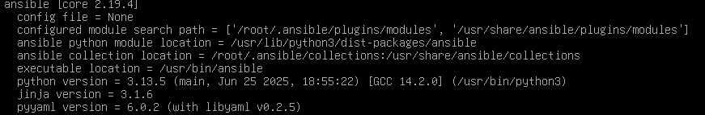

# Automation

## Ansible

> [!NOTE]
> Debian version: 13.3
>
> Ansible versions:



### Ansible installation

```bash
apt install ansible -y
echo -e 'export "ANSIBLE_COW_SELECTION=random"' >> ~/.bashrc # under every user's bash, which will be used to 
```
