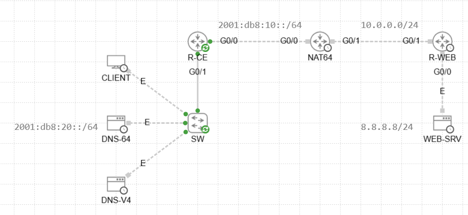

<!-- 
---
title: "NAT64 configuration"
author: "Gergő Téringer"
---
 -->
# NAT64 configuration

Cisco NAT64 configuration with Bind9 as DNS64 server

## 1. Topology

This guide will use the following topology:



The server **WEB-SRV** is a Debian server running Apache2, and configured with **IPv4 only**.

The network on the left **only** has **IPv6** access.

The **DNS-V4** server is running Bind9 and functions as a **mock DNS server**, serving the zone `lego.dk` which contains **only the IPv4 address of WEB-SRV**.

The **DNS-64** server is running Bind9 and is responsible for the **DNS64 conversion** of the **IPv4 addresses** served by the **DNS-V4 server**.

This can be done with the following Bind9 config, which is part of the `/etc/bind/named.conf.options`.

```conf
    recursion yes;
    allow-recursion { any; };
    allow-query { any; };
    forwarders {
            2001:db8:20::4;
    };
    forward only;

    dns64 64:ff9b::/96 {
            clients { any; };
    };
    
    dnssec-validation no;
```

This configuration basically **forwards all requests** to the given forwarder (in this case **DNS-V4**) and in case a given query **only yields an A record**, and no AAAA records, the server will **assemble an AAAA record** by **combining the** `64:ff9b::/96` **prefix and the IPv4 address**. This prefix is the **well-known prefix** for DNS64 conversion.

## 2. Network configuration

All network addresses can be seen on the topology. Static routing is set up on all routers. The following configuration is needed on NAT64 router:

```cisco
interface GigabitEthernet0/0
  nat64 enable

interface GigabitEthernet0/1
  nat64 enable

ipv6 access-list NAT64ACL
  permit ipv6 2001:db8::/32 any

nat64 v4 pool MYPOOL 10.0.0.100 10.0.0.100

nat64 v6v4 list NAT64ACL pool MYPOOL overload
```

> [!NOTE]
> The access list specifies the **permitted networks** the router will do the conversion for.
>
> The **IPv4 pool** is the pool for the **source address translation**. It does not have to match the IPv4 address of the router.

<!-- Created by: Gergő Téringer, 2026 -->